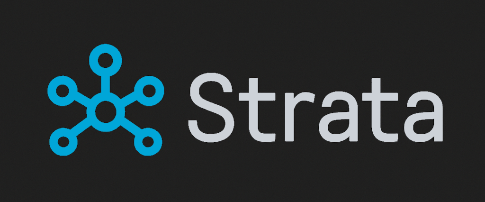

  

# Strata C2

A command-and-control framework written in C++ (Qt 6).

  

## To-Do:
- Agent
  - EXE/DLL Generation via GUI
  - Shellcode generation - planning to do sRDI with custom stub
  - BOFs
  - Assemblies
- Server
  - Azure blob storage support
  - Logging to database
  - Assembly upload and storage
- C2
  - Custom serializers (no more nlohmann JSON)
  - In-transit encryption
  - Cross-compatible